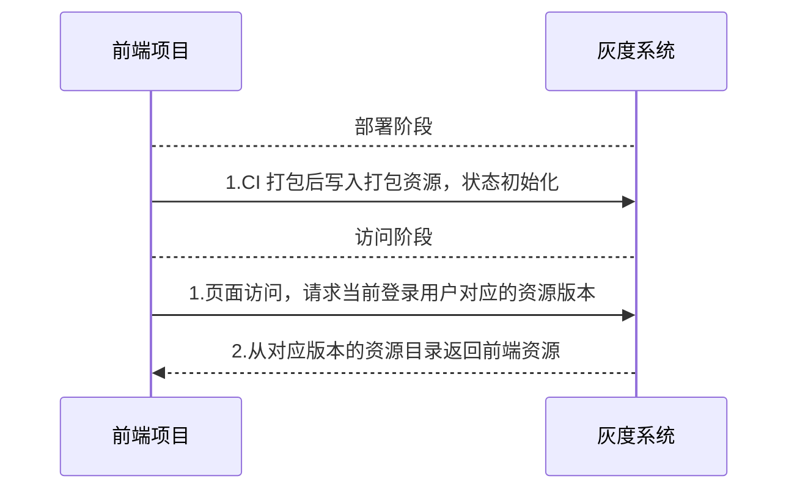
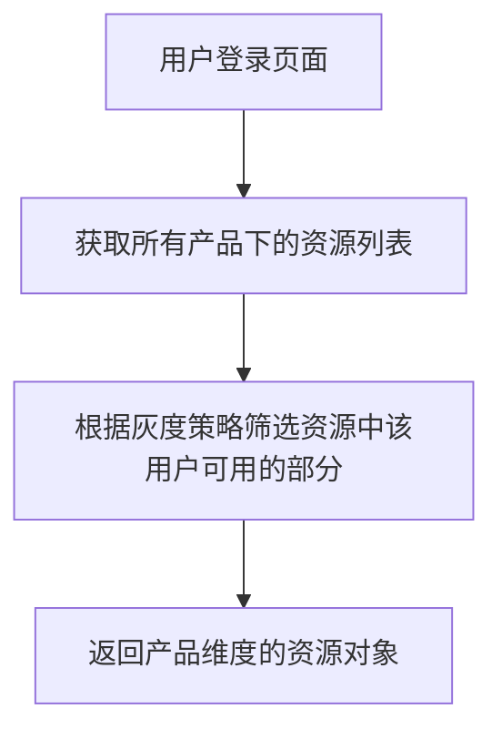
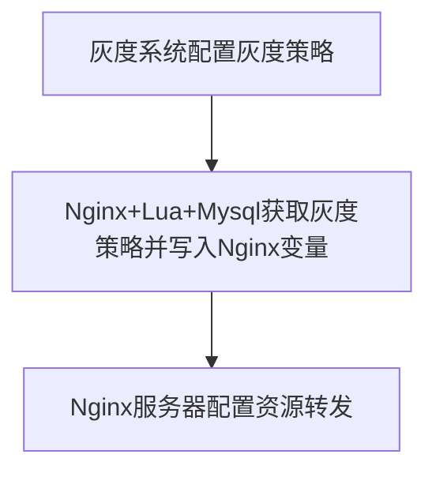

# 写一个简易的前端灰度系统

---

## 1. 写在前面的话

灰度这个概念，来自数字图像领域，最初是描述黑白数字图像的灰度值，范围从 `0` 到 `255`，`0` 表示黑色，`255` 表示白色，中间的数值表示不同程度的灰色。

灰度系统的诞生源于交叉学科的建设，在互联网上也不例外。对于一个软件产品，在开发和发布的时候肯定希望用户能够顺利的看到想让其看到的内容。但是，发布没有一帆风顺的，如果在发布的某个环节出了问题，比如打错了镜像或者由于部署环境不同触发了隐藏的bug，导致用户看到了错误的页面或者旧的页面，这就出现了生产事故。为了避免这种情况出现，借鉴数字图像处理的理念，设计师们设计出了一种介于 `0` 和 `1` 之间的`过渡系统`的概念：让系统可以预先发布，并设置可见范围，就像朋友圈一样，等到风险可控后，再对公众可见。这就是灰度系统。

灰度系统版本的发布动作称作 `灰度发布`，又名金丝雀发布，或者灰度测试，他是指在黑与白之间能够平滑过渡的一种发布方式。在其上可以进行A/B testing，即让一部分用户继续用产品特性A，一部分用户开始用产品特性B，如果用户对B没有什么反对意见，那么逐步扩大范围，把所有用户都迁移到B上面来。(概念来自知乎)

对于前端领域，演进到现在，灰度系统主要有如下几点功能：

1. 增量灰度：小的patch可以增量的添加在发布版本上，也可以通过开关一键关闭
2. 用户灰度：增量和全量版本都可对不同群体或者某几个特定的用户进行灰度可见
3. 版本回退：每一个版本都在灰度系统里可见，可以一键回退

前端灰度系统工作流程图如下：





---

## 2. 灰度规则

关于灰度资源优先级的说明如下：

| 灰度策略 | 优先级 |
| --- | --- |
| 未生效 | 低 |
| 生效 | 高 |
| 全量 | 一般 |

如此就起到了`灰度`的作用：全量表示所有人都可以看；生效表示只有在规则中的用户才可以看到这部分增量更新，优先级最高；未生效表示不灰度，优先级最低。

## 3. 灰度系统数据库设计

> `为什么灰度系统有后端`：前端项目 CI 部署后，会产生一个 commit 号和一个镜像记录，并且打包后的文件存放在服务器中某一个深层的文件夹目录中，灰度系统需要存入该部署的目录地址，便于在切换灰度时查找不同版本的文件。


先介绍一个要部署的前端项目（你可以根据自己的前端项目动态调整）。

本项目针对的前端项目是一个基于微服务架构的项目，

下面是设计ER图：


我们依此来分析：

### 子项目表

该表用于存放所有子项目的信息，新建一个微服务子项目时，会在这个表里新建一个条目，数据示意如下：


### 灰度用户表

用于灰度系统登录的用户，拥有灰度权限的人才可以加入。

### 资源表

资源表存放项目在 CI 中写入的 commit 信息和 build 完以后在服务器的存放位置，数据示意如下：


其中 `branch` 是跑CI的分支，`data` 存放打包资源目录信息，一般结构如下：


`gitProjectId` 存放该产品在 gitlab 中的项目号， `status` 表示构建状态：0：构建完成 1：部署完成 2：构建失败，3：部署失败。

这里简单提一下 CI 是如何写入灰度系统数据库的，过多详情不做解释，写入数据库方式很多，这只是其中一种实现方式。

1. 首先在 CI build 环节往服务器写入打包信息的 JSON：


其中 build.sh 负责把传入的参数写到一个 json 中。上图中是往根目录copy，方便下一个 CI job读取json文件的示意图。

2. 在 CI 部署环节，通过调用脚本创建资源：


其中 run_gray.js:

```js
const { ENV, file, branch, projectId, gitProjectId, user, commitMsg } = require('yargs').argv;

axios({
    url: URL,
    method: "POST",
    headers: {
        remoteUser: user
    },
    data: {
        Action: "CreateResource",
        projectId,
        branch,
        commitMsg,
        gitProjectId,
        channel: Channel,
        data: fs.readFileSync(file, 'utf8'),
        status: "0"
    }
}).then(...)
```
其中 status 的变化，在 CI 部署服务器完成后，追加一个 `UpdateResource` 动作即可：

```
if [[ $RetCode != 0 ]]; then curl "$STARK_URL" -X 'POST' -H 'remoteUser: '"$GITLAB_USER_NAME"'' -H 'Content-Type: application/json' -d '{"Action": "UpdateResource", "id": "'"$ResourceId"'", "status": "2"}' > test.log && echo `cat test.log`; fi
```

### 灰度策略表

灰度策略是对灰度资源的调动配置。其设计如下：


其中，`prijectId` 表示灰度的项目，`resourceId` 表示使用的资源，`rules` 配置了对应的用户或用户组（看你怎么配置了，我这里只配置了单独的 userId），`status` 是灰度的状态，我设置了三种：

- default: 未生效
- failure: 生效
- success: 全量

状态生效表示是增量发布的意思。

到这里，数据库设计就完毕了。

---

## 4. 灰度系统接口API开发

有了数据库，还需要提供能够操作数据库的服务，上边创建资源的接口就是调用的灰度自己的API实现的。主要的API列表如下：


| 名称 | 描述 |
| --- | --- |
| getResourcesByProjectId | 获取单个产品下所有资源 |
| getResourcesById | 通过主键获取资源 |
| createResource | 创建一个资源 |
| updateResource | 更新一个资源 |
| getIngressesByProjectId | 获取单个产品下灰度策略任务列表 |
| getIngressById | 通过主键获取单个灰度策略任务详情 |
| createIngress | 创建一个策略 |
| updateIngress | 更新一个策略 |

剩余的接口有用户处理的，有子项目管理的，这里不做详述。除了上边的必须的接口外，还有一个最重要的接口，那就是获取当前登录用户需要的资源版本的接口。在用户访问时，需要首先调用灰度系统的这个接口来获取资源地址，然后才能重定向到给该用户看的页面中去：

| 名称 | 描述 | 接收参数 | 输出 |
| --- | --- | --- | --- |
| getConsoleVersion | 获取当前用的产品版本 | userId，products | resource键值对列表 |

`getConsoleVersion` 接受两个参数，一个是当前登录的用户 ID， 一个是当前用户访问的微服务系统中所包含的产品列表。该接口做了如下几步操作：

1. 遍历 products，获取每一个产品的 projectId
2. 对于每一个 projectId，联查资源表，分别获取对应的 resourceId
3. 对于每一个resourceId，结合 userId，并联查灰度策略表，筛选出起作用的灰度策略中可用的资源
4. 返回每一个资源的 data 信息。

其中第三步处理相对繁琐一些，比如说，一个资源有两个起作用的灰度资源，一个是增量的，一个是全量的，这里应该拿增量的版本，因为他优先级更高。


获取用户版本的流程图如下：





最后返回的资源大概长这个样子：

```js
interface VersionResponse {
    [productId: number]: ResourceVersion;
}

interface ResourceVersion {
    files: string[];
    config: ResourceConfig;
    dependencies: string[];
}
```

其中 files 就是 JSON 解析后的上述 data 信息的文件列表，因为打包后的文件往往有 css和多个js。

至于这个后端使用什么语言，什么框架来写，并不重要，重要的是一定要稳定，他要挂掉了，用户就进不去系统了，容灾和容错要做好；如果是个客户比较多的网站，并发分流也要考虑进去。

## 5. 前端页面展示

前端页面就随便使用了一个前端框架搭了一下，选型不是重点，组件库能够满足要求就行：

- 登录


- 查看资源


- 配置策略


---

部署以后，实际运行项目看看效果：


可以看到，在调用业务接口之前，优先调用了 getConsoleVersion来获取版本，其返回值是以产品为 key 的键值对：


## 6. 访问转发

这里拿到部署信息后，服务器要进行下一步处理的。我这里是把它封装到一个对象中，带着参数传给了微服务的 hook 去了（微服务系统需要）；**如果你是单页应用，可能需要把工作重心放在 Nginx 的转发上，Nginx内部服务读取灰度系统数据库来拿到版本目录，然后切换路由转发（可能只是改变一个路由变量）。** （你也可以参照我 [nginx 相关文章](https://juejin.cn/post/7211702508371656759)），下面我简单的给个示意图：





## 7. 总结

前端灰度系统，其实就是一个后台管理系统。他配置和管理了不同版本的前端部署资源和对应的用户策略，在需要的时候进行配置。

接下来的文章我会配套性的讲一下 `Nginx` 和 `Docker` 的前端入门使用，敬请期待！

完！大家对灰度系统有什么好的建议，可以在评论区讨论哦！

---