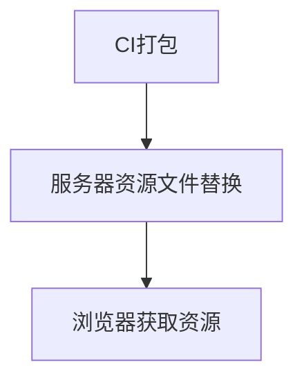
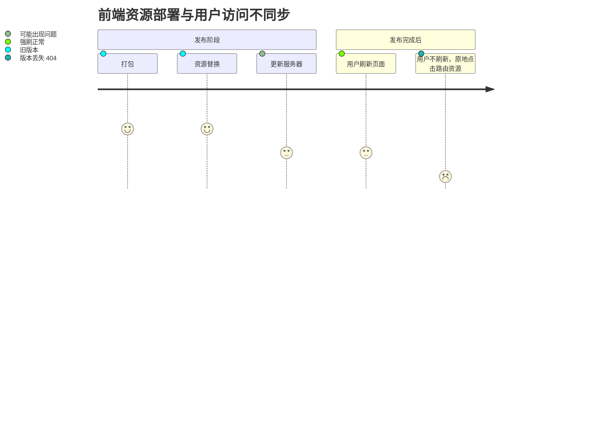
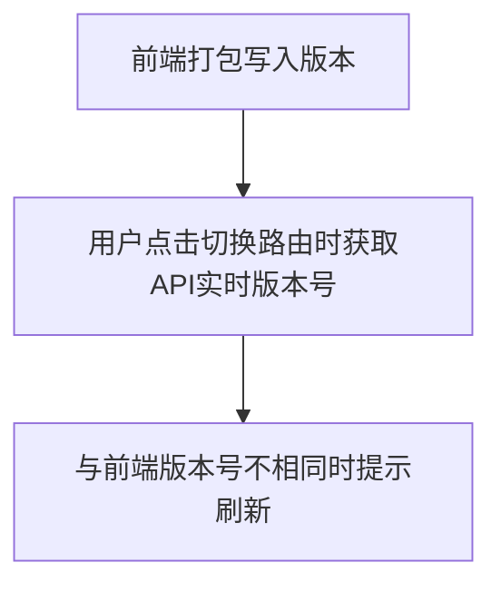

# 针对前端发布新版本后用户页面资源丢失问题的解决方案

---

文章继承自 [记一次前端应用部署后，刷新静态资源丢失问题](https://juejin.cn/post/7269694294597287971) 的方案，这里换一种写法重新阐述，加上一些自己的思考和图文解释。

## 1. 场景重现

前端实现一个路由懒加载时，点击 menu 切换页面时出现资源 404 问题：


项目例子如下：

```js
const AFunction = lazy(() => import('./page/a.js'))
const BFunction = lazy(() => import('./page/b.js'))

function App() {

  return (
    <div className="App">
        <HashRouter basename="/">
          <Link style={{marginRight: 20}} to="/">Home</Link>
          <Link to="/about">About</Link>
          <Suspense fallback={<div>Loading...</div>}>
            <Routes>
              <Route path="/" element={<AFunction />}></Route>
              <Route path="/about" element={<BFunction />} />
            </Routes>
          </Suspense>
        </HashRouter>
    </div>
  );
}
```

上面的例子中，访问 `/` 路径时，`BFunction` 组件是不会被加载的，只会加载 webpack 对应路由的 chunk：


在切换路由到 `/about` 时，会加载这个路由对应的 chunk 文件，反复切换则不会重复加载。

项目与使用场景描述完毕！

## 2. 问题分析

理论上，切换资源是会去服务器获取到对应 chunk 的 js 资源的，出现 404，要么是服务器文件被删除，要么是文件被重新打包，hash 值被改变了。

第一种情况，资源被删除我们不考虑，不可控因素，我们自己也不会没事去删除还在使用的资源的。第二种情况就有可能了，我们本地打了包，替换了资源文件，是会造成 hash 变化的，每次打包都会针对不同的分包 chunk 打不同的 hash 值。

## 3. 问题原理

知道问题后，我们就来看一下打包部署流程出现了那些纰漏。

前端项目简易部署流程如下：




而打包后目前在资源服务器存放目录如下：

```shell
├─console-fe
│  ├─bundle
│  ├─static
│  ├─main.sdf67hda.js
│  └─index.html
```

`index.html` 里引入了该次打包的入口文件：`main.[hash].js`，static 是静态资源文件夹，bundle 是打包好的 js 文件夹。

由于 浏览器有缓存，在用户已经渲染出 index.html 后会产生缓存（比如入口 main.28cb0dcd.js），用户普通刷新页面时，浏览器默认去拿缓存的 入口 js，而分发的各个 chunk 路径是写在 入口 js 文件的，所以就拿不到了。


用流程图描述如下：




## 4. 解决方案

1. 取消缓存 index.html


我们试着从服务端提示阻止 index.html 缓存：

```shell
# nginx
location ~ \.html$ { add_header Cache-Control "no-cache, no-store, must-revalidate"; }
```

再次部署后，发现刷新页面的情况可以拿到新的资源了，但是如果用户停留在老页面，原地点击路由跳转还是不行。这个想想也是可以理解的，没有刷新，入口 main.js 没有改变，所以还需要特殊处理。

2. 前后端统一版本号，跳转时提示需要更新

后端返回的 API 中会带着约定好的适用于前端的版本号，而前端打包时也会通过 CI 写入该版本（可以是 redux、 cookie 或者 本地存储等），在任一请求 API 的地方，前端统一拦截比对两个版本号是否统一，若不统一则自动刷新页面，流程图如下：





这种方案就是经常要提示用户，在多次发布新版本时对用户体验不太友好，但是可以保证用户始终拿到想要的版本。

3. 服务器打包存放历史资源

就像文章开头引用文章所说，资源服务器可以这样存放资源：

```shell
─console-fe
│  ├─20230101
│  │  ├─bundle
│  │  ├─static
│  │  └─main.sdf67hda.js
│  ├─20230302
│  │  ├─bundle
│  │  ├─static
│  │  └─main.qd52s5f7.js
│  ├─index.html
...
```
在部署时，CI 打包时设置一个版本：`BUILD_PATH = "20230101"`，在项目中，只有一个统一的 `index.html`，CI 部署时，在该文件写入制定目录下的脚本入口：

```js
<script src="/20230302/main.qd52s5f7.js"></script>
```
这样，就算用户不刷新页面，新部署的资源不会影响旧的资源，只要控制好打包的大小，定期清理老旧版本文件就可以了。

这个方案的缺点是用户侧版本可能不统一，用户可能会看到旧的版本。但是接入灰度系统就会比较方便，有利有弊。


**综合方案**

综上所述，我们可以总结上述方案的优点，提出一个综合方案：

- 设置不缓存 index.html
- CI 打包时按照方案3，实现历史资源共存
- 接入灰度系统，实现接口获取当前用户前端资源目录，比如：`/20230302/main.qd52s5f7.js`
- 前后端约定好当前登录的灰度用户的版本，API 返回版本信息。

这样，在用户第一次请求页面时，前置调用灰度 API，[灰度系统](https://juejin.cn/post/7212054600162132029)告知 nginx 服务器转发给前端页面。

在用户刷新页面时，会再次调用灰度 API 并更新前端缓存，拿到最新的资源。在用户原地点击 menu 跳转路由时，资源也不会丢失，在 API 中获取灰度系统中登录用户版本号，返回给前端该约定好的版本（BUILD_PATH），前端判断版本不一致时提示用户刷新或者自行刷新页面即可。

----

不知道大家还有什么更好的方案吗？欢迎一起学习交流！